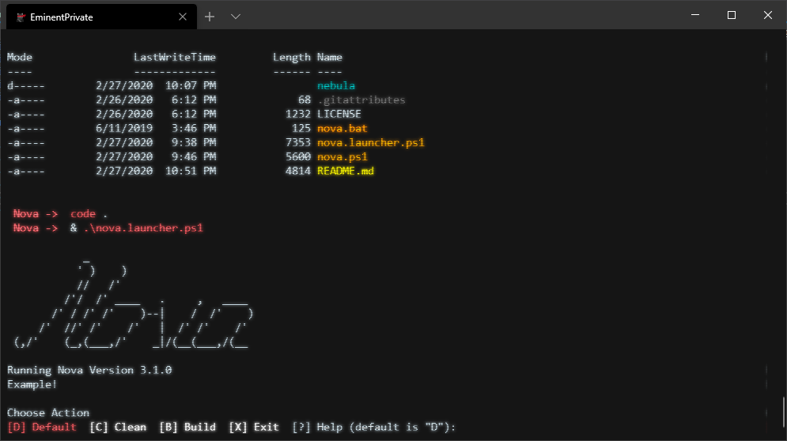

# Nova Build

## Version 3

This is a major departure from Nova 2.
We have moved from two files, to 2+ files, where the + stands for "as many as you need".
I feel like small files comprised of singular tasks that have an easier 'DependsOn' syntax create a better build environment.
I'm one step away from a DSL, though I feel for simple tasks, I still don't quite need it.

## Background

This is slighlty more complex build logic I made to complete simple builds. Things like locally deploying PowerShell modules, compiling simple CSharp and FSharp DLLs and command line apps, or sharing intra-business solutions from a network drive.
Builds are now tree dependent.

It's very lightweight and works really well for those purposes. For more complicated builds, look into Psake, Invoke-Build, Fake or Cake.

I wrote Nova really fast three years ago to make a couple different builds to deploy modules onto machines via CDs (remember those?).
The machines only had Version 2 on them and they were air-gapped.
I could have locally copied Psake, but for such simple builds, I didn't want to go through the trouble of all the data transfer that would've been needed.

## Usage

First, you need a Task file.

1. Create a file named _yourTask.Task.ps1_ and place it in the nebula.
2. In this file, create a normal PowerShell function. It should be named _yourTask_ (whatever the filename is). When you invoke a task, it'll invoke the function name, not the file.
3. In this build system, an attribute named 'DependsOn' is available. You can make your task depend on another by using it.
4. You can also depend on more than one task, though the syntax is a little funky.
5. Invoke the Nova script by calling it (it cannot be sourced)
6. Finally you can stuff all your task functions into one file.

All tasks are dynamically loaded by Nova, so you get tab-completion for free.

! If no task is given to Nova, it will try to run a task named `Default`.
! You should have one named that.

\* Use `Invoke-Task` in your task function to call nest another task function and all its dependent tasks.

### Example 1

``` powershell
# Test.Task.ps1
function Test {
    [DependsOn('Init')]
    param ([switch] $All)

    if ($All) {
        Invoke-Pester
    }
    else {
        Invoke-Pester Deploy
    }
}

# PS> nova.ps1 -Task Test -Log
```

### Example 2

``` powershell
# Clean.Task.ps1
function Clean {
    [CmdletBinding('SupportShouldProcess')]
    [DependsOn('Init')]
    param()

    if ($PSCmdlet.ShouldProcess('Clean')) {
        Remove-Item src/* -Force -Recurce
    }
}

# PS> nova.ps1 -Task Clean -Test
```

### Example 3

``` powershell
# Build.Task.ps1
function Build {
    [DependsOn(('Init', 'Clean'))]   # Note the double paranthesis
    param()   # This is a requirement of attributes with no CmdletBinding call... we need a param block even if its empty

    csc /t:$Nebula.Build.Target /o:$Nebula.Build.OutPath /r:($Nebula.Build.Refs -join ';')
}

# PS> nova.ps1 -Task Build -Test
# ! WILL actually execute csc because csc does not support what if and you didn't make Build support it
```

## Files

This build system has necessary files:

- nova.ps1
- nebula.ps1

You should never alter these files.

### Nova

Nova has evolved from the build logic to the build validation and entry point.
Nova is the overall control for the build.

Nova validates available tasks for the build and allows for both testing and logging.
Testing sets the WhatIfPreference to true; most, if not all, commands will be skipped.
If you want your written tasks and functions to support this, make sure you use `SupportsShouldProcess`!
True Cmdlets should handle this automatically.
Logging sets the VerbosePreference to Continue; tasks should use `Write-Verbose` for logging.

### Nebula

This is the build startup script.
Nebula initializes essential funtions and tasks, then invokes a task sent from Nova.
Nebula does not return a value.
  
Nebula creates a script variable named Result that should contain success/fail information.
It will automatically log success, failures, invoked tasks, and time information.
I still haven't figured out how to automatically log warnings; I may depreciate that eventually.

You _could_ hack Nebula to include custom build environment-wide variables and functions.
But, I would prefer you simply include a Initialize task of some kind that does this.
All Task files will be carried into the script scope of Nebula for this purpose.
I also include a config file that'll allow you to access static information build-wide with the `$Nebula` variable.

### TUI

There is now a small TUI built in.
Use nova.bat to easily access the nova.launcher.ps1 file, which is the TUI.
This script will poll the config file to create a nice little prompt that asks you for a task!
Read its help and investivate the config file to see how it's used.



### Examples

The files included in nebula\ act as examples.
They should be pretty simple to figure out.
